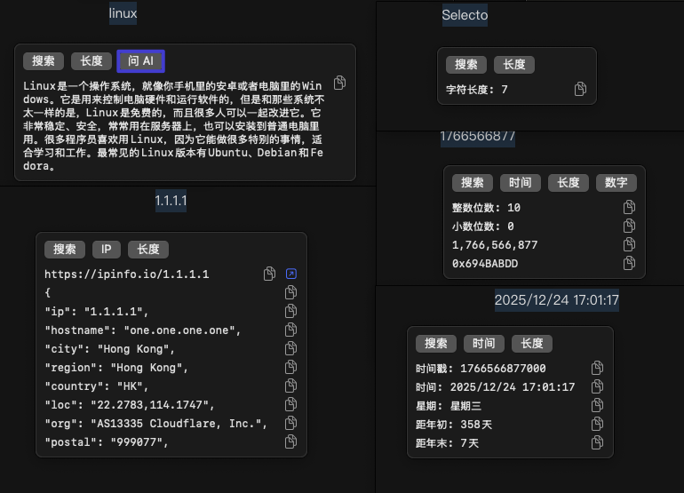
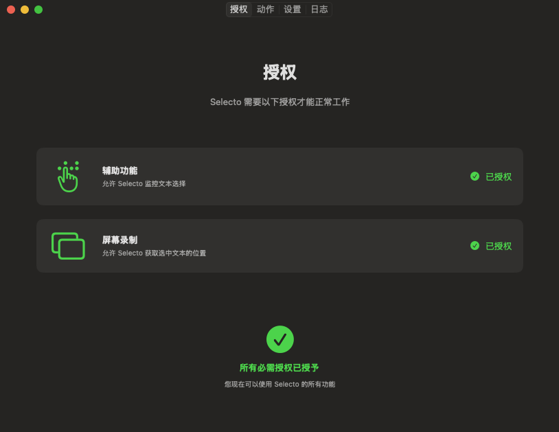

# Selecto

一个轻量但强大的 macOS 划词增强工具 / A powerful macOS text selection enhancement tool



[中文](#中文) | [English](#english) 

## 中文

### 简介

Selecto 是一个使用 Swift 开发的 macOS 应用程序，当用户选中一段文本时，会在文本上方自动显示一个浮动工具栏，提供多种可自定义的功能。

### 主要特性

- 🛠️ **浮动工具栏** - 自动检测文本选择，在选中文本上方显示优雅的浮动工具栏
- ⚙️ **高度可定制** - 通过设置界面配置各种动作和触发条件，比如执行 shell 脚本、打开链接等
- 🔍 **正则表达式支持** - 使用正则表达式匹配特定文本模式
- 🎨 **轻量** - 使用 SwiftUI 构建，体积非常小

### 功能列表

#### 内置动作类型

1. **打开链接** - 基于 URL 模板在浏览器中打开选中文本
2. **运行脚本** - 直接编写 Shell 脚本并在工具栏查看输出

#### 高级功能

- **正则表达式匹配** - 设置触发条件，只在特定文本模式下显示动作
- **动作排序** - 自定义工具栏中动作的显示顺序
- **启用/禁用** - 灵活控制每个动作的启用状态
- **参数化配置** - 为动作设置 URL 模板、脚本路径等参数

### 系统要求

- macOS 10.15 (Catalina) 或更高版本
- Xcode 14.0 或更高版本（仅用于构建）

### 权限要求

Selecto 需要以下系统权限才能正常工作：

1. **辅助功能 (Accessibility)** - 用于监控文本选择事件
2. **屏幕录制 (Screen Recording)** - 用于获取选中文本的位置信息（macOS 10.15+）



首次运行时，应用会自动引导您授予这些权限。

### 安装与使用

#### 从 Release 下载（推荐）

访问 [Releases 页面](https://github.com/echosoar/selecto/releases) 下载最新版本的 DMG 文件：

- **Universal (通用版)** - 支持 Apple Silicon (M1/M2/M3) 和 Intel 芯片
- **ARM64** - 仅支持 Apple Silicon (M1/M2/M3)
- **x86_64** - 仅支持 Intel 芯片

下载后双击 DMG 文件，将 Selecto.app 拖到 Applications 文件夹即可。

**💡 首次运行提示**

由于应用使用 ad-hoc 签名（非 Apple Developer 证书签名），首次运行时 macOS 可能会提示"无法验证开发者"。这是正常的安全提示，请按以下方式打开：

- 右键点击应用，选择"打开"，在弹出的对话框中点击"打开"按钮

之后应用就可以正常双击打开了。

#### 从源码构建

```bash
# 克隆仓库
git clone https://github.com/echosoar/selecto.git
cd selecto

# 使用 Xcode 打开项目
open Selecto/Selecto.xcodeproj

# 或使用命令行构建
xcodebuild -project Selecto/Selecto.xcodeproj -scheme Selecto -configuration Release
```

#### 基本使用

1. 启动 Selecto 应用
2. 授予必要的系统权限
3. 在任何应用中选中一段文本
4. 工具栏会自动出现在选中文本上方
5. 点击工具栏中的按钮执行相应动作

#### 配置动作

1. 点击菜单栏中的 Selecto 图标
2. 选择"设置 (Settings)"
3. 在设置界面中：
   - 添加新动作
   - 编辑现有动作
   - 配置匹配条件（正则表达式）
   - 设置动作参数
   - 调整动作顺序
---

## English

### Introduction

Selecto is a macOS application developed in Swift that automatically displays a floating toolbar above selected text, providing various customizable functions.

### Key Features

- 🎯 **Smart Text Selection Monitoring** - Automatically detects system-wide text selection
- 🛠️ **Floating Toolbar** - Displays an elegant floating toolbar above selected text
- ⚙️ **Highly Customizable** - Configure various actions and trigger conditions through settings
- 🔍 **Regular Expression Support** - Match specific text patterns using regex
- 📋 **Curated Action Types** - Focused on opening links and running custom scripts
- 📝 **Built-in Script Editor** - Author and store shell scripts right inside settings
- 🔒 **Permission Management** - Automatically checks and requests necessary system permissions
- 🎨 **Modern UI** - Beautiful settings interface built with SwiftUI

### Features

#### Built-in Action Types

1. **Open Link** - Launch a browser using flexible URL templates
2. **Run Script** - Author shell scripts inline and inspect output immediately

#### Advanced Features

- **Regular Expression Matching** - Set trigger conditions to show actions only for specific text patterns
- **Action Sorting** - Customize the display order of actions in the toolbar
- **Enable/Disable** - Flexibly control the enabled state of each action
- **Parameterized Configuration** - Set URL templates, script paths, and other parameters for actions

### System Requirements

- macOS 10.15 (Catalina) or later
- Xcode 14.0 or later (for building only)

### Permission Requirements

Selecto requires the following system permissions to function properly:

1. **Accessibility** - To monitor text selection events
2. **Screen Recording** - To get the position of selected text (macOS 10.15+)

On first run, the app will automatically guide you to grant these permissions.

### Installation & Usage

#### Download from Releases (Recommended)

Visit the [Releases page](https://github.com/echosoar/selecto/releases) to download the latest DMG file:

- **Universal** - Supports both Apple Silicon (M1/M2/M3) and Intel chips
- **ARM64** - Apple Silicon (M1/M2/M3) only
- **x86_64** - Intel chips only

After downloading, double-click the DMG file and drag Selecto.app to the Applications folder.

**💡 First Launch Note**

Since the app uses ad-hoc signing (not signed with an Apple Developer certificate), macOS may show an "unverified developer" warning on first launch. This is a normal security prompt. To open the app:

- Right-click the app, select "Open", then click "Open" in the dialog

After this, the app can be opened normally by double-clicking.

#### Build from Source

```bash
# Clone the repository
git clone https://github.com/echosoar/selecto.git
cd selecto

# Open project with Xcode
open Selecto/Selecto.xcodeproj

# Or build with command line
xcodebuild -project Selecto/Selecto.xcodeproj -scheme Selecto -configuration Release
```

#### Basic Usage

1. Launch the Selecto app
2. Grant necessary system permissions
3. Select text in any application
4. The toolbar will automatically appear above the selected text
5. Click buttons in the toolbar to execute corresponding actions

#### Configure Actions

1. Click the Selecto icon in the menu bar
2. Select "Settings"
3. In the settings interface:
   - Add new actions
   - Edit existing actions
   - Configure match conditions (regular expressions)
   - Set action parameters
   - Adjust action order

### License

MIT License - see [LICENSE](LICENSE) file for details

### Contributing

Contributions are welcome! Please feel free to submit a Pull Request.

### Author

x@codersoar

### Support

If you encounter any issues or have suggestions, please [open an issue](https://github.com/echosoar/selecto/issues).
